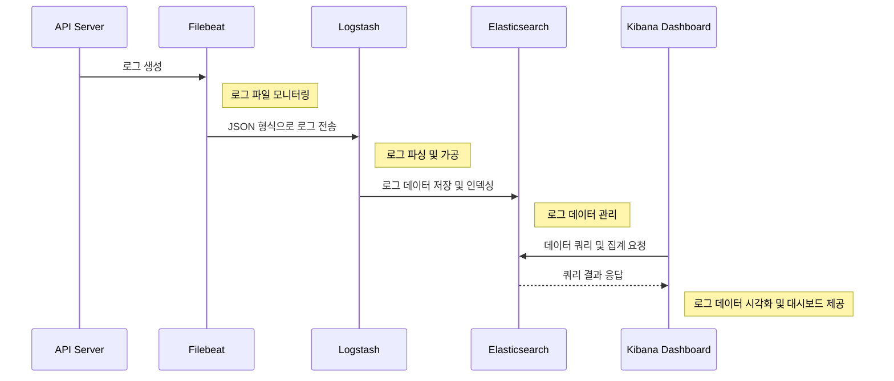

# Project Name

## 목차
- [프로젝트 소개](#프로젝트-소개)
- [실행 방법](#실행-방법)
- [아키텍처 및 설계](#아키텍처-및-설계)

## 프로젝트 소개
todo

## 아키텍처 및 설계


## 실행 방법

#### Step 1
```shell
git clone [프로젝트 URL]
cd [클론한 프로젝트 폴더]
```

#### Step 2
```shell
# 빌드
./gradlew clean build

# docker image 생성
docker build -t monitoring:1.0 .

# docker volume 생성
docker volume create monitoring-logs

# docker network 생성
docker network create topy-monitoring

# monitoring-api 실행
docker-compose up -d
```

#### Step 3
```shell
# filebeat 실행
cd src/main/java/monitoring/filebeat
docker-compose up -d
```

#### Step 4
```shell
# elasticsearch, logstash, kibana 실행
cd src/main/java/monitoring/elk
docker-compose up -d
```

#### Step 5
```shell
# 실행 중인 컨테이너 조회
docker ps

# elasticsearch container 접속 
docker exec -it [elasticsearch container ID] sh

# elasticsearch 계정 설정
# (interactive: 수동 / auto: 자동)
$ bin/elasticsearch-setup-passwords interactive

# 종료
$ exit
```

#### Step 6
```shell
# Step5에서 설정한 kibana_system 계정으로 kibana.yml파일 수정

# example
( kibana.yml )
elasticsearch.username: {kibana user id}
elasticsearch.password: {kibana user pwd}

↓↓↓

elasticsearch.username: 'kibana_system'
elasticsearch.password: 'password'
```

#### Step 7
```shell
# kibana 접속
# 계정: Step5에서 설정한 elastic 계정 사용하여 로그인
localhost:5601
```

#### Step 8
```shell
# logstash, kibana의 user, role 생성

메뉴 탭(좌측 상단) -> Management -> Security -> Users, Roles 생성

(Role)
Role name: {Role 이름}
Cluster privileges: all
Index privileges - Indices: *
Index privileges - Privileges: all

(User)
Username: {User 이름}
Password: {비밀번호}
Privileges - Roles: {Role에서 설정한 Role Name 입력}
+ kibana 계정에는 생성한 Kibana Role과 함께 kibana_system Role도 추가
```

#### Step 9
```shell
# Step8에서 생성한 Custom 계정으로 logstash, kibana 파일 수정

# example
( kibana.yml )
elasticsearch.username: {kibana user id}
elasticsearch.password: {kibana user pwd}

( logstash.yml )
monitoring.elasticsearch.username: {logstash user id}
monitoring.elasticsearch.password: {logstash user pwd}

( logstash.conf )
user  =>  {logstash user id}
password  =>  {logstash user pwd}
```

#### Step 10
```shell
# logstash, kibana 재실행
cd src/main/java/monitoring/elk
docker-compose restart logstash kibana
```