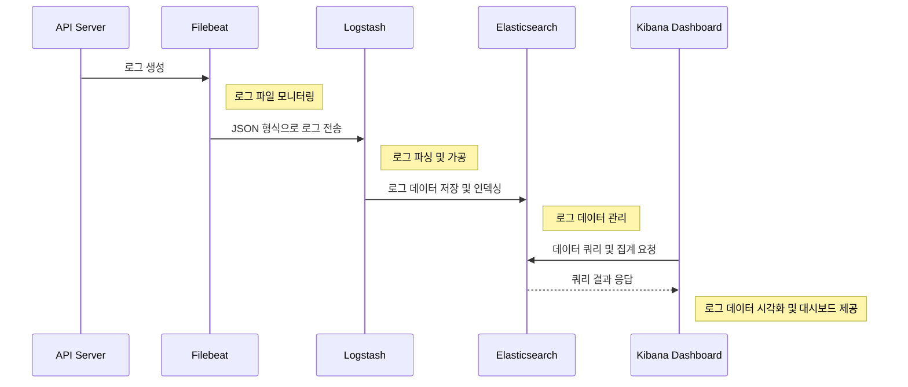
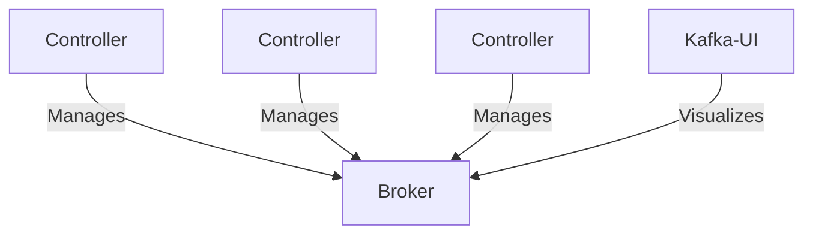

# Elastic Stack & Kafka Cluster

Elasticsearch 8.0과 Apache Kafka® 3.5에서의 주요 변경사항을 살펴본다.

#### 목차

- [Elastic Stack](#1-elastic-stack)
- [Kafka Cluster](#2-kafka-cluster)

## 1. Elastic Stack

Elastic Stack은 Elastic 회사에서 개발한 오픈 소스 소프트웨어 제품군으로, 다양한 소스에서 어떠한 형식의 데이터든 실시간으로 검색, 분석 및 시각화하는 데 도움을 주는 통합 솔루션이다.
본 프로젝트에서는 Elastic Stack의 주요 구성 요소 중 하나인 Elasticsearch에서 제공하는 X-Pack 플러그인을 살펴보고자 한다.

#### 사용 기술

- Elasticsearch, Logstash, Kibana, Filebeat

### 1.1 X Pack

- Elasticsearch 버전 6.8부터 X-Pack 플러그인 무료화
- X-Pack 보안 기능을 사용하여 Elastic Stack의 구성요소들을 인증과 인가를 통해 계정으로 관리
- Elasticsearch 버전 8.0부터 X-Pack 보안 기능의 기본 설정값 true로 변경

### 1.2 ELK Stack Flow



### 1.3 ELK Stack 실행 방법

<details>
<summary><b><i><u> [ ELK Stack 실행 절차 ] </u></i></b></summary>
<div markdown="1">

#### Step 01

```shell
git clone [프로젝트 URL]
cd [클론한 프로젝트 폴더]
```

#### Step 02

```shell
# 빌드
./gradlew clean build

# docker image 생성
docker build -t api:1.0 .

# docker volume 생성
docker volume create api-logs

# docker network 생성
docker network create api_network
docker network create monitoring_network

# monitoring-api 실행
docker-compose up -d
```

#### Step 03

```shell
# filebeat 실행
cd src/main/java/monitoring/filebeat
docker-compose -f filebeat-docker-compose.yml up -d
```

#### Step 04

```shell
# elasticsearch 실행
cd src/main/java/monitoring/elk
docker-compose -f elk-docker-compose.yml up -d elasticsearch
```

#### Step 05

```shell
# 실행 중인 컨테이너 조회
docker ps

# elasticsearch container 접속 
docker exec -it [elasticsearch container ID] sh

# elasticsearch 계정 설정
# (interactive: 수동 / auto: 자동)
$ bin/elasticsearch-setup-passwords interactive

# 종료
$ exit
```

#### Step 06

```shell
# Step5에서 설정한 kibana_system 계정으로 kibana.yml파일 수정

( kibana.yml )
elasticsearch.username: 'kibana_system'
elasticsearch.password: '{kibana_system_password}'
```

#### Step 07

```shell
# kibana 실행
docker-compose -f elk-docker-compose.yml up -d elasticsearch kibana

# kibana 접속
# 계정: Step5에서 설정한 elastic 계정 사용하여 로그인
localhost:5601
```

#### Step 08

```shell
# logstash user, logstash role 생성
메뉴 탭(좌측 상단) -> Management -> Security -> Users, Roles 생성

(Role)
Role name: {Role 이름}
Cluster privileges: all
Index privileges - Indices: *
Index privileges - Privileges: all

(User)
Username: {User 이름}
Password: {비밀번호}
Privileges - Roles: {Role에서 설정한 Role Name 입력}
```

#### Step 09

```shell
# Step8에서 생성한 logstash 계정으로 설정 파일 변경

# example
( logstash.yml )
monitoring.elasticsearch.username: '{your logstash id}'
monitoring.elasticsearch.password: '{your logstash password}'

( logstash.conf )
user	=> '{your logstash id}'
password	=> '{your logstash password}'
```

#### Step 10

```shell
# logstash 실행
docker-compose -f elk-docker-compose.yml up -d logstash
```

</div>
</details>

<br>
<br>

## 2. Kafka Cluster

Kafka Cluster의 메타데이터는 ZooKeeper라는 외부서비스를 통해 관리되어 왔다. 하지만, Apache Kafka® 3.5부터 Zookeeper가 Deprecated되면서
Kafka Cluster의 메타데이터를 Kafka 자체 토픽에 저장하여 관리하는 KRaft Mode 사용이 권장되기 시작했다.
이 프로젝트에서는 KRaft Mode의 구조와 장점을 살펴보고자 한다.

#### 사용 기술

- KRaft Mode

### 2.1 KRaft Mode

- 메타데이터를 Kafka 내부 토픽에 저장하여 관리함으로써 외부 시스템과의 통신 오버헤드를 줄임
- Kafka Cluster 자체의 노드 간 Raft 알고리즘을 사용하여 메타데이터의 일관성을 유지
    - 장애 복구 및 확장성 향상

### 2.2 Kafka Structure



### 2.3 Kafka Cluster 실행 방법

#### Step 01

```shell
# Kafka Cluster 실행
cd src/main/java/project/kafka
docker-compose -f kafka-docker-compose.yml up -d
```