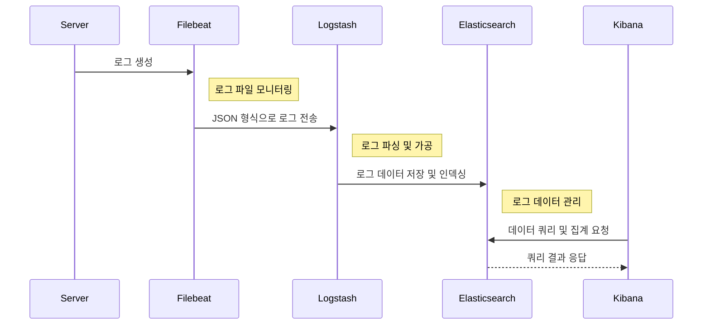
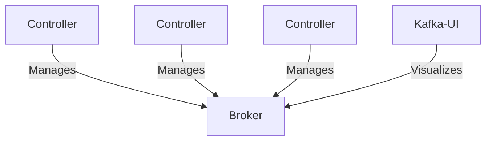

# Elastic Stack & Kafka Cluster

Elasticsearch 8.0과 Apache Kafka® 3.5에서의 주요 변경사항을 살펴본다.

#### 목차

- [Elastic Stack](#1-elastic-stack)
- [Kafka Cluster](#2-kafka-cluster)

## 1. Elastic Stack

Elastic Stack은 Elastic 회사에서 개발한 오픈 소스 소프트웨어 제품군으로, 다양한 소스에서 어떠한 형식의 데이터든 실시간으로 검색, 분석 및 시각화하는 데 도움을 주는 통합 솔루션이다.
본 프로젝트에서는 Elastic Stack의 주요 구성 요소 중 하나인 Elasticsearch에서 제공하는 X-Pack 플러그인을 살펴보고자 한다.

#### 사용 기술

- Elasticsearch, Logstash, Kibana, Filebeat

### 1.1 X Pack

- Elasticsearch 버전 6.8부터 X-Pack 플러그인 무료화
- X-Pack 보안 기능을 사용하여 Elastic Stack의 구성요소들을 인증과 인가를 통해 계정으로 관리
- Elasticsearch 버전 8.0부터 X-Pack 보안 기능의 기본 설정값 true로 변경

### 1.2 Elastic Stack Flow



### 1.3 ELK 실행 방법

#### Step 01

```shell
# elasticsearch 실행
docker-compose -f elk-docker-compose.yml up -d elasticsearch

# elasticsearch 계정 비밀번호 생성 (interactive: 수동 / auto: 자동)
$ docker exec -it $(docker ps -qf "name=elk-elasticsearch") sh bin/elasticsearch-setup-passwords auto|interactive
```

#### Step 02

```shell
# kibana.yml
# Step 01에서 설정한 kibana_system 비밀번호 설정
elasticsearch.username: 'kibana_system'
elasticsearch.password: 'kibana_system_password'

# kibana 실행
docker-compose -f elk-docker-compose.yml up -d kibana
```

#### Step 03

```shell
# kibana 접속
# Step 01에서 설정한 elastic 계정으로 로그인
localhost:5601

# logstash user, logstash role 생성
좌측 상단 메뉴 탭 -> Management -> Security -> Users, Roles 생성
```


#### Step 04

```shell
# Step 03에서 생성한 logstash 계정으로 설정 파일 변경
# logstash.yml
monitoring.elasticsearch.username: 'your_logstash_username'
monitoring.elasticsearch.password: 'your_logstash_password'

# logstash.conf
output {
  elasticsearch {
    user      => 'your_logstash_username'
    password  => 'your_logstash_password'
  }
}

# logstash 실행 
docker-compose -f elk-docker-compose.yml up -d logstash
```

<br>

## 2. Kafka Cluster

Kafka Cluster의 메타데이터는 ZooKeeper라는 외부서비스를 통해 관리되어 왔다. 하지만, Apache Kafka® 3.5부터 Zookeeper가 Deprecated되면서
Kafka Cluster의 메타데이터를 Kafka 자체 토픽에 저장하여 관리하는 KRaft Mode 사용이 권장되기 시작했다.
이 프로젝트에서는 KRaft Mode의 구조와 장점을 살펴보고자 한다.

#### 사용 기술

- KRaft Mode

### 2.1 KRaft Mode

- 메타데이터를 Kafka 내부 토픽에 저장하여 관리함으로써 외부 시스템과의 통신 오버헤드를 줄임
- Kafka Cluster 자체의 노드 간 Raft 알고리즘을 사용하여 메타데이터의 일관성을 유지
    - 장애 복구 및 확장성 향상

### 2.2 Kafka Structure



### 2.3 Kafka Cluster 실행 방법

#### Step 01

```shell
# Kafka Cluster 실행
cd src/main/java/project/kafka
docker-compose -f kafka-docker-compose.yml up -d
```