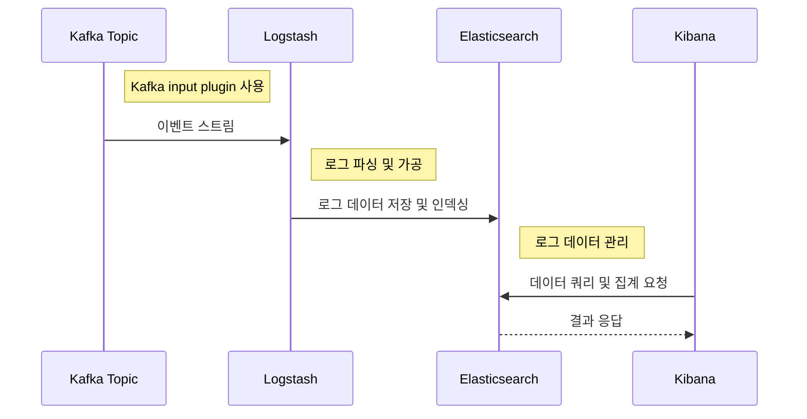

# Event Monitoring

이 프로젝트는 Kafka Cluster를 중심으로 구축된 실시간 이벤트 처리 및 모니터링 시스템입니다. 여러 도메인 서비스에서 발생하는 이벤트는 Kafka Cluster를 통해 스트리밍되며, Event Bridge Server를 통해 관리 및 라우팅됩니다. Logstash의 Kafka 플러그인을 통해 Elastic Stack으로의 데이터 플로우를 구성했으며, Elasticsearch에서 데이터를 수집하고 Kibana 대시보드로 시각화합니다. 프로젝트는 Elasticsearch 8.0 및 Apache Kafka® 3.5의 주요 업데이트를 반영하여 진행됩니다.

#### 사용기술

- Java, Gradle, SpringBoot, Logback, Elastic Stack, Kafka


## 아키텍처 및 설계

### 1. Kafka Cluster

#### 1.1 Controller

Kafka Cluster의 메타데이터는 과거에 ZooKeeper라는 외부 서비스를 통해 관리되었습니다. 그러나 Apache Kafka® 3.5 버전부터 Zookeeper의 사용이 Deprecated 되고, Kafka 자체 토픽을 활용한 메타데이터 관리, 즉 KRaft Mode로의 전환을 권장하고 있습니다.

- 메타데이터를 Kafka 내부 토픽에 저장하여 관리함으로써 외부 시스템과의 통신 오버헤드 감소
- Kafka Cluster 내부의 노드 간에 Raft 합의 알고리즘을 사용하여 메타데이터의 일관성을 유지
    - 장애 복구 및 확장성 향상


#### 1.2 Broker

복제 계수(Replication Factor)를 3으로 설정함으로써, 각 파티션은 고가용성을 확보하여 시스템의 안정성을 보장합니다. 프로젝트에서는 business-logs 토픽에 이벤트를 발행할 때, `User`와 `Order`라는 두 개의 파티션 키를 사용합니다. 이는 각각의 도메인에서 발생하는 로그 정보를 분리하여, 서로 다른 Slack 채널로 전달되도록 합니다.

 ⁃ 


#### 1.3 Kafka Cluster 실행 방법

```shell
# Kafka Cluster 실행
cd src/main/java/project/kafka
docker-compose -f kafka-docker-compose.yml up -d
```

<br>

### 2. Elastic Stack

### 2.1 X-Pack

X-Pack은 Elastic Stack의 주요 보안 기능을 제공하는 확장 플러그인입니다. Elasticsearch 6.8 버전부터 X-Pack은 무료로 제공되기 시작했으며, 이를 통해 Elastic Stack의 다양한 구성 요소에 대한 보안 기능을 강화할 수 있게 되었습니다.

- Elasticsearch 8.0 버전부터는 X-Pack 보안 기능이 기본적으로 활성화되어 배포 `security.enabled: true`
- X-Pack의 보안 기능을 활용하여 Elastic Stack 구성 요소들에 대한 접근을 인증 및 인가 기반의 계정 관리를 통해 제어

### 2.2 Elastic Stack Flow



### 1.3 ELK 실행 방법

<details>
  <summary><b><i><ins>How to start ELK</ins></i></b></summary>

#### Step 01

```shell
# elasticsearch 실행
docker-compose -f elk-docker-compose.yml up -d elasticsearch

# elasticsearch 계정 비밀번호 생성 (interactive: 수동 / auto: 자동)
$ docker exec -it $(docker ps -qf "name=elk-elasticsearch") sh bin/elasticsearch-setup-passwords auto|interactive
```

#### Step 02

```shell
# kibana.yml
# Step 01에서 설정한 kibana_system 비밀번호 설정
elasticsearch.username: 'kibana_system'
elasticsearch.password: 'kibana_system_password'

# kibana 실행
docker-compose -f elk-docker-compose.yml up -d kibana
```

#### Step 03

```shell
# kibana 접속
# Step 01에서 설정한 elastic 계정으로 로그인
localhost:5601

# logstash user, logstash role 생성
좌측 상단 메뉴 탭 -> Management -> Security -> Users, Roles 생성
```


#### Step 04

```shell
# Step 03에서 생성한 logstash 계정으로 설정 파일 변경
# logstash.yml
monitoring.elasticsearch.username: 'your_logstash_username'
monitoring.elasticsearch.password: 'your_logstash_password'

# logstash.conf
output {
  elasticsearch {
    user      => 'your_logstash_username'
    password  => 'your_logstash_password'
  }
}

# logstash 실행 
docker-compose -f elk-docker-compose.yml up -d logstash
```

</details>

## 결과

- todo